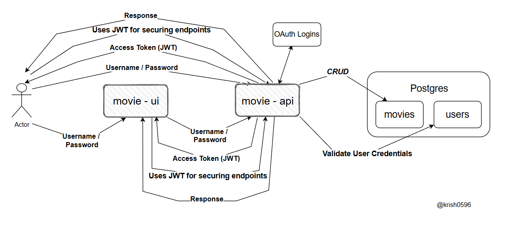

# springboot-react-social-login

The goal of this project is to implement an application called `movie-app` to manage movies. For it, we will implement a back-end [`Spring Boot`](https://docs.spring.io/spring-boot/docs/current/reference/html/documentation.html) application called `movie-api` and a font-end [React](https://react.dev/) application called `movie-ui`. Besides, we will use [`OAuth2`](https://en.wikipedia.org/wiki/OAuth#OAuth_2.0) (Social Login) to secure both applications.

## Project Diagram



## Applications

- ### movie-api

  `Spring Boot` Web Java backend application that exposes a Rest API to create, retrieve and delete movies. If a user has `ADMIN` role he/she can also retrieve information of other users or delete them. The application secured endpoints can just be accessed if a valid JWT access token is provided.
  
  In order to get the JWT access token, the user can login using the credentials (`username` and `password`) created when he/she signed up directly to the application.
  
  `movie-api` stores its data in [`Postgres`](https://www.postgresql.org/) database.

  `movie-api` has the following endpoints:

  | Endpoint                                                      | Secured | Roles           |
  | ------------------------------------------------------------- | ------- | --------------- |
  | `POST /auth/authenticate -d {"username","password"}`          | No      |                 |
  | `POST /auth/signup -d {"username","password","name","email"}` | No      |                 |
  | `GET /public/numberOfUsers`                                   | No      |                 |
  | `GET /public/numberOfMovies`                                  | No      |                 |
  | `GET /api/users/me`                                           | Yes     | `ADMIN`, `USER` |
  | `GET /api/users`                                              | Yes     | `ADMIN`         |
  | `GET /api/users/{username}`                                   | Yes     | `ADMIN`         |
  | `DELETE /api/users/{username}`                                | Yes     | `ADMIN`         |
  | `GET /api/movies [?text]`                                     | Yes     | `ADMIN`, `USER` |
  | `POST /api/movies -d {"imdb","description"}`                  | Yes     | `ADMIN`         |
  | `DELETE /api/movies/{imdb}`                                   | Yes     | `ADMIN`         |

- ### movie-ui

  `React` frontend application where a user with role `USER` can retrieve the information about movies. On the other hand, a user with role `ADMIN` has access to all secured endpoints, including endpoints to create and delete movies.
  
  In order to access the application, a `user` or `admin` can login using his/her `Github` account or using the credentials (`username` and `password`) created when he/she signed up directly to the application. All the requests coming from `movie-ui` to secured endpoints in `movie-api` have the JWT access token. This token is generated when the `user` or `admin` logins.
  
  `movie-ui` uses [`Semantic UI React`](https://react.semantic-ui.com/) as CSS-styled framework.

## Prerequisites

- [`npm`](https://docs.npmjs.com/downloading-and-installing-node-js-and-npm)
- [`Java 17+`](https://www.oracle.com/java/technologies/downloads/#java17)
- [`Docker`](https://www.docker.com/)
- [`jq`](https://stedolan.github.io/jq)

## Start Environment

- In a terminal, make sure you are inside `springboot-react-social-login` root folder;

- Run the following command to start docker compose services:
  ```
  docker compose up -d
  ```

## Running movie-app using Maven & Npm

- **movie-api**

  - Open a terminal and navigate to `springboot-react-social-login/movie-api` folder;

  - Export the following environment variables for the `Client ID` and `Client Secret` of the Social Apps (see how to get them in [Creating OAuth2 apps for Social Login](#creating-oauth2-apps-for-social-login)):
    ```
    export GITHUB_CLIENT_ID=...
    export GITHUB_CLIENT_SECRET=...
    export GOOGLE_CLIENT_ID=...
    export GOOGLE_CLIENT_SECRET=...
    ```

  - Run the following `Maven` command to start the application:
    ```
    ./mvnw clean spring-boot:run
    ```

- **movie-ui**

  - Open another terminal and navigate to `springboot-react-social-login/movie-ui` folder;

  - Run the command below if you are running the application for the first time:
    ```
    npm install
    ```

  - Run the `npm` command below to start the application:
    ```
    npm start
    ```

## Applications URLs

| Application  | URL                                   | Credentials                                         |
| ------------ | ------------------------------------- | --------------------------------------------------- |
| movie-api    | http://localhost:8080/swagger-ui.html |                                                     |
| movie-ui     | http://localhost:3000                 | `admin/admin`, `user/user` or signing up a new user |

## Demo

- The gif below shows a `user` loging in using the `Github`:

  

- The gif below shows an `admin` loging in using his application account:

  

## Util Commands

- **Postgres**
  ```
  docker exec -it postgres psql -U postgres -d moviedb
  \dt
  ```

## Shutdown

- To stop `movie-api` and `movie-ui`, go to the terminals where they are running and press `Ctrl+C`;

- To stop and remove docker compose containers, network and volumes, go to a terminal and, inside `springboot-react-social-login` root folder, run the command below:
  ```
  docker compose down -v
  ```